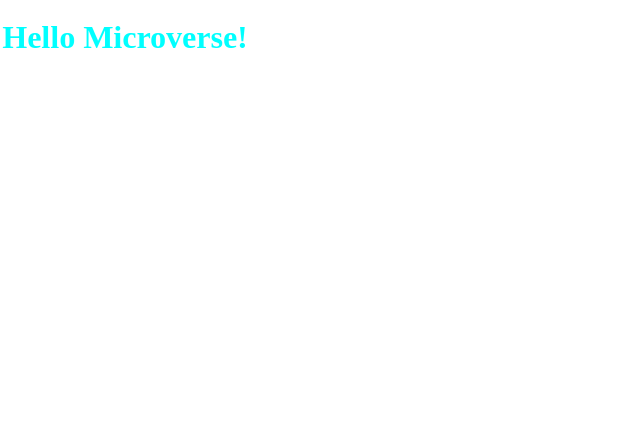

# Hello Microverse

##Description

> The objective of this project is to master all the tools, the best practices that we have learned in the previous steps and to do it in practice. Such as GitHub flow, GitHub action, linter configuration.

## Built With

- HTML
- CSS

## Getting Started

- To get a local copy up and running follow these simple example steps.

### Prerequisites

- You need to have git installed in your computer.

### Setup

- To clone my repository run this command `git clone https://github.com/cynthiainga/Hello-World.git`

## Author

👤 **Kandilero Inga Cynthia**

- GitHub: [@cynthiainga](https://github.com/cynthiainga)
- Twitter: [@CynthiaInga_C](https://twitter.com/CynthiaInga_C)
- LinkedIn: [Cynthia Inga](https://www.linkedin.com/in/cynthia-inga7/)

## 🤝 Contributing

Contributions, issues, and feature requests are welcome!

Feel free to check the [issues page](../../issues/).

## Show your support

Give a ⭐️ if you like this project!

## Acknowledgments

- Hat tip to anyone whose code was used
- Inspiration
- etc

## 📝 License

This project is [MIT](./MIT.md) licensed.
